# Linked Data Shape Manager - The Proposal

Interoperability is difficult, people say.

With **Shape Manager**, we want to make it straightforward for application developers to achieve interoperability by _emergent consensus_.

Inspired by Node Package Manager, we intend to build "npm" for shapes that Linked Data applications use, with particular emphasis on [Solid Project](https://solidproject.org).

## Overview

We intend to provide a hub and tooling to easily compose, share, and discover Linked Data applications' data shapes, thereby nurturing interoperability within the Linked Data and Solid ecosystem.

The core idea of the proposal is to create a tool for developers to easily display, co-create, and publish the shapes they use in apps. This tool will also provide an overview of the supershape, highlighting which components are most relevant based on their actual usage.

In other words, a bottom-up, pragmatic approach to creating and sharing data shapes.

## Background

In the context of Linked Data, shapes can be expressed in standard formats like [Shex](https://shex.io/) or [SHACL](https://www.w3.org/TR/shacl/); and less formally in a picture:

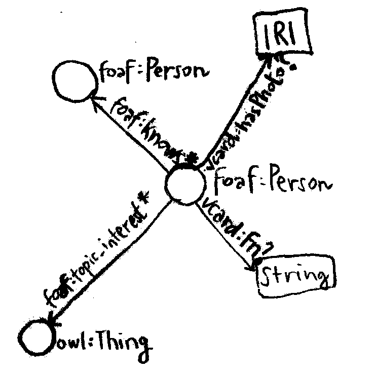

Shapes provide templates for how to describe and store information about a person or idea or recipe...

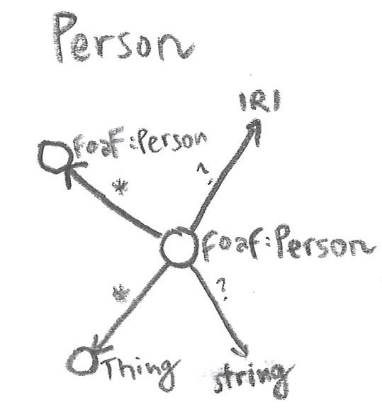 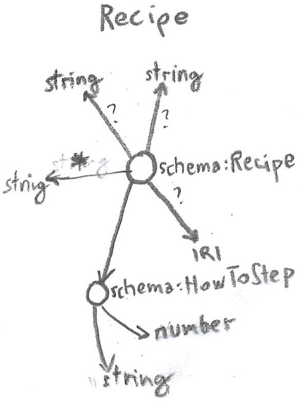 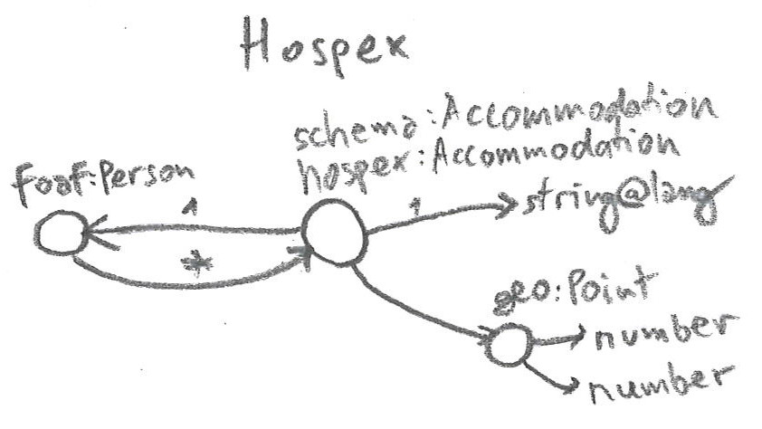 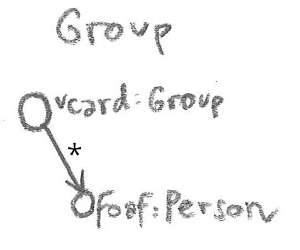 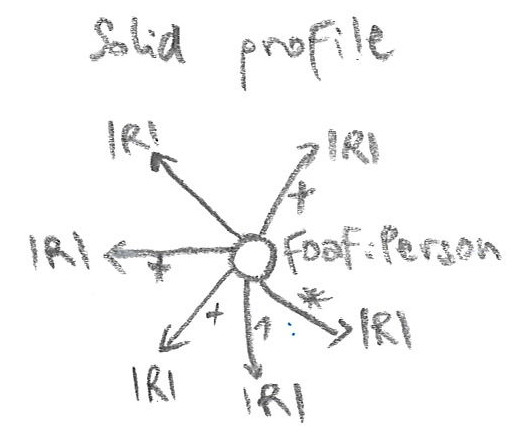 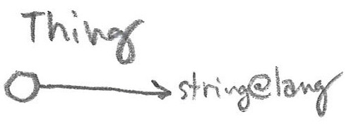

These shapes are interrelated, collectively forming a larger shape of shapes.

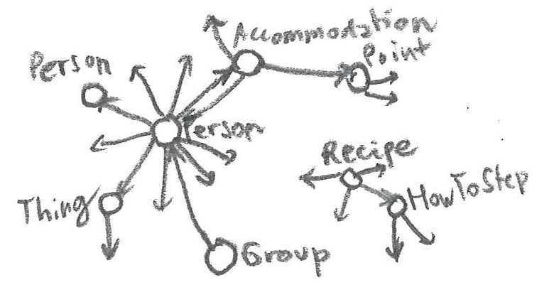

Each application focuses on different subsets of these shapes.

For example, most applications will want to display or edit person's name and profile picture. Additional shapes are used depending on the application's purpose: a cookbook app will work with a recipe shape, while a map app will work with points of interest and coordinates.

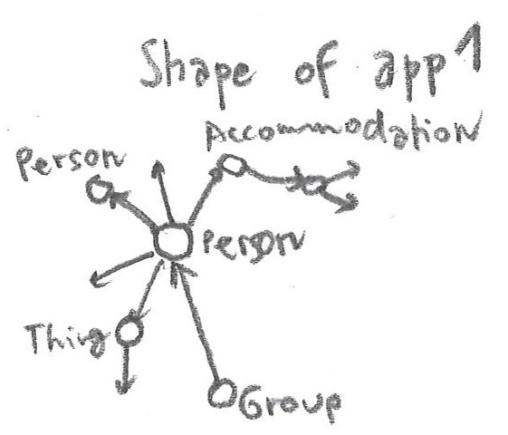 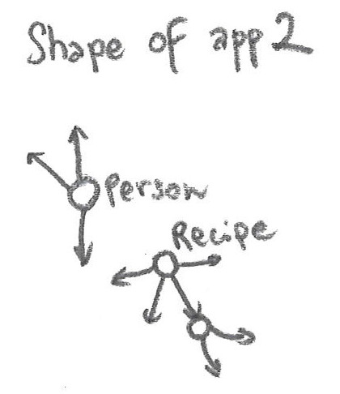

Together they form a bigger picture:

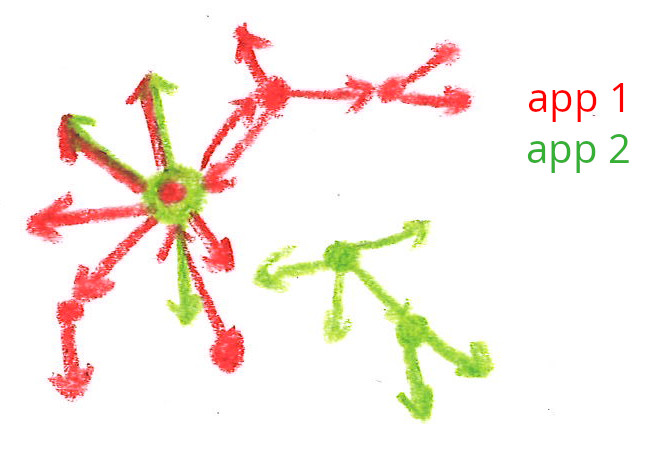

To ensure that applications can understand each other, developers need to agree on the shapes they use.

If I can see what data shapes other developers have used, I can build an application that is at least partially interoperable by using the same shapes as much as possible.

Agreeing on data shapes is a crucial part of Solid application interoperability.

There are other important aspects besides shapes, such as access control and data discovery, which we do not cover in this proposal but may extend in the future.

## Tools and Features

- Advertise the shape of an existing app
- Browse existing shapes and apps
- Compose shapes for new apps
- See how apps are interoperable

- npm package for integration with the JavaScript ecosystem
- API for other ecosystems

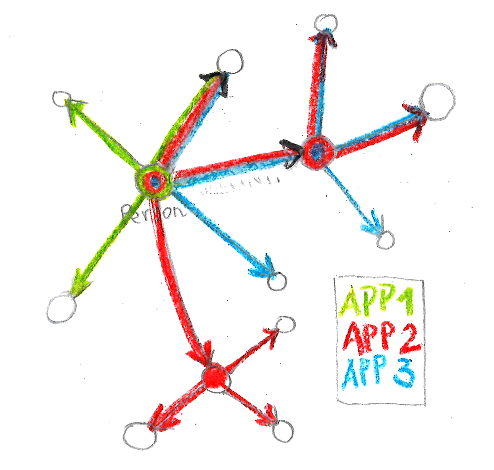

### Advertise

- `sham publish` Publishes local shapes to ldsham registry
  - shapes are versioned along the lines of npm

### Develop

- Search available vocabularies and shapes, and see how they're used in apps
- Establish an easy way to extend existing shapes with new concepts
- Visualize shapes, their overlap, and their usage in apps
- Select the subshapes you care about
- Upload your existing shape, modify it, and download the resulting shape
- Ensure compatibility with [LDO](https://ldo.js.org/) by e.g. using compatible file structure

### Tools

- Generate a package with app's vocabulary namespace (similar to [rdf-namespaces](https://npmjs.com/package/rdf-namespaces))
- Generate TypeScript types (LDO already does this, so maybe not needed)
- Shape visualization and visual shape composer
- Generate a [ldhop](https://github.com/ldhop/ldhop) query based on the app shape

## Dogfooding

- Use Solid identity for authentication
- Use ClientId to identify apps
- Some form of decentralization of the registry with Solid?
